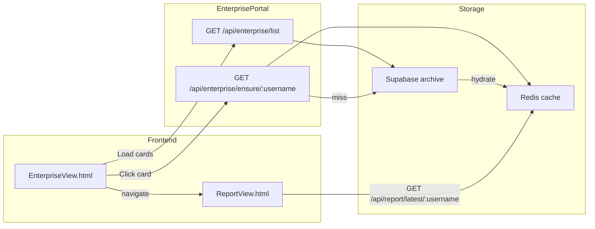

# Enterprise Portal with Supabase Archive and Redis Cache

## Current state

- **Redis**: Full reports keyed by `report:user:${username}`; written when analysis job completes in [backend/src/utils/queue.js](backend/src/utils/queue.js). [backend/src/utils/cache.js](backend/src/utils/cache.js) exposes `getReportByUsername` / `setReportByUsername`.
- **Report shape** (from [backend/src/services/analysisService.js](backend/src/services/analysisService.js)): `{ report, scores, scoreBreakdown, strengthsWeaknesses, technicalHighlights, improvementSuggestions, hiringRecommendation }`. Frontend expects this (e.g. `report.user.avatar_url`, `report.user.login`, `data.scores.overallScore`) in [frontend/script.js](frontend/script.js) `renderReport(data)`.
- **Report View**: [frontend/ReportView.html](frontend/ReportView.html) uses [frontend/interface.css](frontend/interface.css), [frontend/script.js](frontend/script.js), and `API_BASE = "http://localhost:5000"`. It does not currently read a `?username=` query param on load; it only gets data via the search form (which first tries `GET /api/report/latest/:username` then falls back to starting a new analysis).
- **Backend**: API-only (no static serving). No Supabase usage yet.

## Architecture

- **Supabase**: Long-term archive; one table for stored reports.
- **Redis**: Source of truth for the app; enterprise "ensure" hydrates Redis from Supabase on demand.

## 1. Supabase setup

- **Table**: e.g. `archived_reports` with:
  - `username` (text, primary key) — canonical GitHub login
  - `report` (jsonb) — full payload written to Redis today (same shape as `runAnalysis` result)
  - `created_at` (timestamptz, optional)
- **Backend**: Add `@supabase/supabase-js`. New env: `SUPABASE_URL`, `SUPABASE_SERVICE_ROLE_KEY` (in [backend/src/config/env.js](backend/src/config/env.js) and [backend/.env.example](backend/.env.example)).
- **Service**: New module e.g. [backend/src/services/archiveService.js](backend/src/services/archiveService.js):
  - `saveReport(username, report)` — upsert into `archived_reports` (no-op or log if Supabase not configured).
  - `listArchived()` — returns `[{ username, score, avatar_url }]` from Supabase (score from `report.scores.overallScore`, avatar from `report.report.user.avatar_url`; handle missing scores for older rows).
  - `getReport(username)` — returns full report object or null.

## 2. Persist to Supabase when analysis completes

- In [backend/src/utils/queue.js](backend/src/utils/queue.js), after `setReportByUsername(canonicalUsername, result)`, call `archiveService.saveReport(canonicalUsername, result)` (guard on Supabase being configured so the app still runs without it).

## 3. Enterprise API routes

- New router mounted under `/api/enterprise` (e.g. [backend/src/routes/enterprise.js](backend/src/routes/enterprise.js)):
  - **GET /api/enterprise/list** — call `archiveService.listArchived()`, return JSON array of `{ username, score, avatar_url }`. Return 200 with `[]` if Supabase unavailable or empty.
  - **GET /api/enterprise/ensure/:username** — (1) Try `getReportByUsername(username)` from Redis; if found, return 200. (2) Else try `archiveService.getReport(username)`; if found, call `setReportByUsername(username, report)` then return 200. (3) Else 404. This keeps Redis as the cache and Supabase as the source when Redis has expired.

## 4. Report View: load by URL username

- In [frontend/script.js](frontend/script.js), on DOMContentLoaded (or after existing init): if the page URL has a `username` query param (e.g. `ReportView.html?username=foo`), call `fetch(\`${API_BASE}/api/report/latest/${username})`and on success call`renderReport(data)` so the user lands on Report View with that report without using the search form. No new analysis is triggered; the enterprise flow will have already ensured the report is in Redis.

## 5. Enterprise portal HTML and behavior

- **New file**: [frontend/EnterpriseView.html](frontend/EnterpriseView.html). Reuse the same conventions as ReportView:
  - Same `<head>`: `interface.css`, `script.js`, same fonts, favicon, viewport.
  - Same header block: `#header` with logo and "GitHunter" (or "Enterprise" if you prefer a different label).
  - Main content: a title (e.g. "Archived reports") and a container (e.g. `id="enterprise-cards-container"`) for cards.
- **Cards**: One card per list entry: avatar image, username, score. Use the same visual language as ReportView (e.g. same font, similar card style from `interface.css` if available, or minimal card styling consistent with the app).
- **Behavior** (in script.js, gated by presence of `#enterprise-cards-container` so ReportView is unchanged):
  - On load: `GET /api/enterprise/list` and render cards (avatar, username, score).
  - On card click: `GET /api/enterprise/ensure/:username`; on 200, navigate to `ReportView.html?username=<username>` (relative). On 404, show a short message (e.g. "Report not found").
- **Loading/empty**: Show a loading state while fetching list; show an empty state if the list is empty.

## 6. File and route summary

| Area     | Action                                                                                                                                           |
| -------- | ------------------------------------------------------------------------------------------------------------------------------------------------ |
| Backend  | Add `SUPABASE_URL`, `SUPABASE_SERVICE_ROLE_KEY` to env.js and .env.example                                                                       |
| Backend  | Add `archiveService.js` (Supabase client, saveReport, listArchived, getReport)                                                                   |
| Backend  | Add `routes/enterprise.js` (GET list, GET ensure/:username) and mount at `/api/enterprise`                                                       |
| Backend  | In queue.js, after writing to Redis, call archiveService.saveReport                                                                              |
| Frontend | script.js: URL-username handling for ReportView; enterprise container detection and logic (fetch list, render cards, ensure + navigate on click) |
| Frontend | New EnterpriseView.html (structure + container for cards; cards rendered by script.js)                                                           |

## 7. Optional: shared API_BASE

- ReportView and EnterpriseView both use the same script.js and API_BASE. If you later serve the app from different origins, consider a single config (e.g. from a data attribute or a tiny inline config in each HTML) so both pages stay in sync.

## Out of scope (per your note)

- Google/Slides integration is unchanged and not required for this portal.

