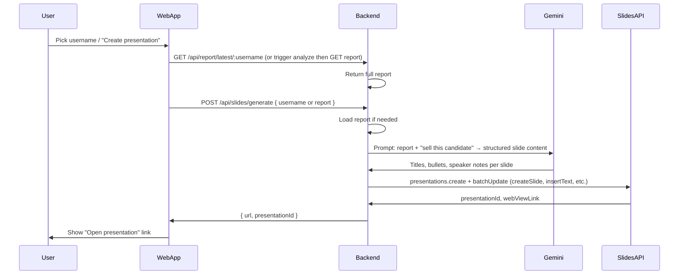

# Presentation Add-on: PowerPoint vs Google Slides

## Your question: Is Google Slides easier with Gemini?

**Short answer: Yes.** For your use case (backend fetches report → AI builds a deck that sells the person), **Google Slides is the easier path**:

| Factor                     | PowerPoint add-in                                                                      | Google Slides                                                                                                                                                                                                                           |
| -------------------------- | -------------------------------------------------------------------------------------- | --------------------------------------------------------------------------------------------------------------------------------------------------------------------------------------------------------------------------------------- |
| **Where creation happens** | User’s machine (add-in runs Office.js, polls for commands)                             | **Backend** (Slides API creates the whole deck)                                                                                                                                                                                         |
| **Architecture**           | Web app + polling + thin add-in + command queue (see [pp_proposal.md](pp_proposal.md)) | **Single backend flow**: report → Gemini → Slides API → return link                                                                                                                                                                     |
| **User experience**        | User must have PowerPoint open and add-in loaded; commands execute locally             | User gets **a link** to open the deck in the browser; no add-in install                                                                                                                                                                 |
| **Gemini relationship**    | Same Gemini API; no special “Slides” integration                                       | Same Gemini API; **no native “Gemini creates Slides” API** — you call Gemini for content, then Slides API for structure. Ease comes from **one vendor (Google)** and **server-side creation**, not from a magic Gemini–Slides handshake |
| **Auth**                   | Your backend auth + session tokens for add-in                                          | Google Cloud: **one project** with Slides API + optional Drive; OAuth for “create in user’s Drive” or service account for “create in app Drive and share link”                                                                          |

**Conclusion:** Use **Google Slides** for the “generate a deck from a report” feature. Keep a **PowerPoint add-on** as an optional later phase if you need in-PowerPoint editing or enterprise requirements (e.g. “must use Office”).

---

## Investigation: Can the APIs work with Gemini? (Workspace "edit directly")

You asked whether the **APIs** (or a different Google LLM) can achieve what **Gemini in Google Slides** does in the Workspace UI — where [Gemini can edit Slides directly](https://support.google.com/docs/answer/14207419?hl=en) (generate slides, write content, summarize, etc.).

**Findings:**

1. **"Gemini in Google Slides" (Workspace Labs) is UI-only.**
  The in-product experience (Ask Gemini in the top-right of Slides) is **not** exposed as a public developer API. There is no REST or server API that says "send a prompt and have Gemini edit this Slide." So we **cannot** call that same "edit directly" experience from our Node backend.
2. **The APIs that *do* work together (and are documented):**
  - **Gemini API** (same one you use: `generativelanguage.googleapis.com`, e.g. Gemini 3 Flash) — generates **content** (titles, bullets, speaker notes). It does not touch Slides by itself.  
  - **Google Slides API** (REST: `presentations.create`, `presentations.batchUpdate`) — creates and edits the deck (slides, shapes, text). No LLM built in.  
  - **Together:** Your backend calls Gemini to get structured slide content, then calls the Slides API to create the presentation and insert that content. That *is* the programmatic way to "Gemini + Slides."  
  - **Apps Script variant:** Google's [Automate Google Workspace tasks with the Gemini API](https://codelabs.developers.google.com/codelabs/gemini-workspace) codelab uses **Apps Script** (JavaScript in Google's cloud) with the **same Gemini API** plus **SlidesApp** (Apps Script's built-in Slides API). Pattern: user query → Gemini function calling (e.g. `createDeck(topic)`) → your script calls Gemini again for bullet points → **SlidesApp** creates the deck and sets text. So "Gemini + Slides" in code is always: **Gemini (content) + Slides API or SlidesApp (apply edits)**. There is no separate "Gemini edits Slides" API.
3. **Different Google LLM?**
  The in-Slides experience is powered by Gemini (Workspace Labs). There is no other Google LLM with a special "edit Slides" API. The **same** Gemini API you already use (e.g. Gemini 3 Flash) is the one that pairs with the Slides API; no different model is required. The "edit directly" feel in the UI is simply not available as a server API.

**Bottom line for the plan:** Our approach (backend: report → **Gemini API** for slide content → **Google Slides API** to create and fill the deck) is the correct and supported way to get "Gemini + Slides" programmatically. It replicates the *outcome* of "AI builds a deck" even though it is not the same as the in-product "Ask Gemini" button.

---

## Backend: What you already have

Existing routes in [backend/src/routes/analyze.js](backend/src/routes/analyze.js) are enough for the add-on:

- `**GET /api/report/latest/:username**` — Returns full report (same shape as job report). Use this when the user selects a GitHub username that has already been analyzed.
- `**GET /api/report/:jobId**` — Use after polling `GET /api/status/:jobId` when a new analysis was just run.

Report payload shape (from [analysisService.js](backend/src/services/analysisService.js) and [pdfService.js](backend/src/services/pdfService.js)):

- `report`: `{ user, repos, stats }` (login, name, public_repos, stats.language, stats.stars, commits, pulls, etc.)
- `scores`: `overallScore`, `categoryScores` (codeQuality, projectComplexity, documentation, consistency, technicalBreadth)
- `scoreBreakdown`, `strengthsWeaknesses`, `technicalHighlights`, `improvementSuggestions`, `hiringRecommendation`

No new report routes are required; the add-on (or backend) will call these from the same backend.

---

## Recommended direction: Google Slides flow

- **New backend surface:** One endpoint, e.g. `**POST /api/slides/generate**` (or `**POST /api/presentation/generate**`). Input: `{ username }` or `{ report }` (if client already has report). Backend: ensure report (from cache or run analysis), call Gemini to turn report into slide-by-slide content, then call Google Slides API to create the deck and return the link.
- **Stakeholder ideas from [powerpoint_prompt.txt**](powerpoint_prompt.txt) (template-driven generation, multi-slide mini-deck, research/workflows) map cleanly: Gemini prompt produces a 5–10 slide outline and content; Slides API creates slides and inserts text. “Sell the person” is the prompt focus (recruiter view, recommendation, strengths, highlights).

---

## Implementation outline (Google Slides)

1. **Google Cloud**
  - One GCP project: enable **Google Slides API** (and optionally **Drive API** if you want “save to user’s Drive”).
  - Auth: either **service account** (backend creates deck in a shared Drive/folder and returns link) or **OAuth** (create in user’s Drive). Service account is simpler for an internal/recruiter tool.
2. **Backend (existing Node server)**
  - New route: e.g. `POST /api/slides/generate` (or under a small `presentation` router).
  - Resolve report: by `username` → `GET /api/report/latest/:username` or trigger analyze and wait/poll; by `report` in body → use as-is.
  - **Gemini**: Reuse existing [aiService.js](backend/src/services/aiService.js) (Gemini 3 Flash) with a **separate prompt** (or a dedicated “slide content” function) that takes the full report and returns structured content, e.g.:
    - `{ title, slides: [ { title, bullets[], speakerNotes? } ] }`
  - **Slides API**: Use `googleapis` (e.g. `googleapis.slides('v1').presentations.create` then `presentations.batchUpdate` with `createSlide`, `createShape`/placeholder, `insertText`) to build the deck from Gemini’s output. Reuse patterns from [pdfService.js](backend/src/services/pdfService.js) for which sections to include (overview, scores, strengths/weaknesses, technical highlights, recommendation).
3. **Frontend**
  - From Recruiter (or shared) UI: “Create presentation” for the current candidate; call `POST /api/slides/generate` with `username`; show returned link (e.g. “Open in Google Slides”).
4. **Optional: PowerPoint later**
  - If you add PowerPoint: same report + same Gemini slide-content step; instead of Slides API, backend pushes **commands** (e.g. insert slide, insert text) into a queue; thin PowerPoint add-in (as in [pp_proposal.md](pp_proposal.md)) polls and executes via Office.js. More moving parts; only worth it if Slides is not acceptable.

---

## Styling: How the deck will look

Styling is controlled by **theme/layout** (from the presentation) and optionally **per-element overrides** via the Slides API.

**Option A — Template-based (recommended for a branded look)**  

- Store a **template presentation** in Google Drive (e.g. “GitHunter Candidate Deck”) with your chosen theme, fonts, colors, and slide layouts (title, title+body, section header).  
- Backend: use **Drive API `files.copy**` to copy the template to a new file (optionally into a shared folder or the user’s Drive), then use **Slides API `presentations.batchUpdate**` to replace placeholder text or to clear default text and insert generated content (titles, bullets, speaker notes) into the existing shapes.  
- **Result:** Every generated deck uses the same theme and layout; no need to set fonts/colors in code. Design changes = edit the template once.

**Option B — Blank presentation + default theme**  

- Backend: **Slides API `presentations.create**` with a title only → creates a blank deck with Google’s default theme.  
- Use **CreateSlideRequest** with **predefined layouts** (e.g. `TITLE`, `TITLE_AND_BODY`) so each slide has a title shape and body shape; the default theme supplies fonts and colors.  
- **Result:** Clean, consistent structure with minimal code; look-and-feel is “default Google” unless you add explicit styling.

**Option C — Explicit styling via API**  

- After creating slides and inserting text, send **UpdateTextStyleRequest** (and, if needed, **UpdateParagraphStyleRequest** for bullet styling) in `batchUpdate` to set for specific ranges: `fontFamily`, `fontSize`, `foregroundColor` (RGB), `bold`, `italic`, `link`.  
- [Editing and Styling Text](https://developers.google.com/workspace/slides/api/guides/styling) documents this.  
- **Result:** Full control (e.g. brand colors, custom fonts) but more code and index management (text ranges); best for targeted tweaks rather than defining the whole theme in code.

**Practical recommendation:** Start with **Option B** (blank + predefined layouts) for a fast MVP with readable, consistent slides. If you want a branded “GitHunter” look (logo, colors, custom fonts), add **Option A** (template in Drive, copy then fill) and keep Option C for small overrides only if needed.

---

## Summary

- **Use Google Slides** for the “query report → AI builds a presentation that sells the person” feature: backend-only creation, one GCP project, same Gemini for content, no add-in required, link-based UX.
- **Reuse** `GET /api/report/latest/:username` (and existing report shape); add one **presentation generation** endpoint that uses Gemini for slide content and Google Slides API for deck creation.
- **PowerPoint add-on** remains possible later with the same report + Gemini content, but delivered via command polling and Office.js; implement only if you have a hard requirement for PowerPoint.

