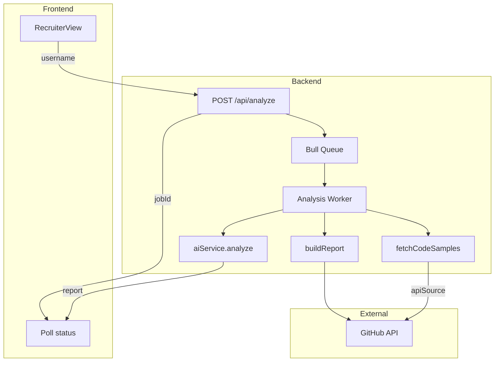

# GitHunter AI-Analysis Checkpoint Plan — Implementation Details

**Checkpoint:** Architecture & requirements locked. Ready for implementation of AI Analysis.  
**Constraint:** Hackathon due in 12 hours.  
**Deployment target:** Railway (backend) + Netlify (frontend optional).

---

## 1. Stakeholder Requirements

The web app must:


| Requirement                                    | Status                        |
| ---------------------------------------------- | ----------------------------- |
| Accept a GitHub username                       | Done                          |
| Analyze repositories                           | Partial (metadata only today) |
| Understand project intent and architecture     | Not implemented               |
| Review code like a senior engineer             | Not implemented               |
| Produce a structured hiring-grade report with: |                               |
| — Scores                                       | Not implemented               |
| — Strengths & weaknesses                       | Not implemented               |
| — Technical highlights                         | Not implemented               |
| — Improvement suggestions                      | Not implemented               |
| — Hiring recommendation                        | Not implemented               |


---

## 2. Architecture Decisions

### 2.1 Code Access: Dual-Tier Design

- **Basic (default):** GitHub API — Trees API + Contents API. No git binary, works everywhere, fast to ship.
- **Premium (future):** Git clone — Full repo access, deeper analysis, marketable as paid upgrade.

Both produce the same data shape so the rest of the pipeline is shared.

### 2.2 Pluggable Code Source

```
Analysis Pipeline (AI, report generation)
         │
         │  consumes: { username, repos: [{ name, files: [{ path, content, language }] }] }
         │
         ▼
┌────────────────────────────────────────┐
│  fetchCodeSamples(username, repos, opts)│
│  opts.useClone ? cloneSource : apiSource│
└────────────────────────────────────────┘
```

- `apiSource.js` — Trees + Contents API, file selection heuristics
- `cloneSource.js` — `git clone --depth 1`, walk & sample (add later)
- Shared interface; clone falls back to API on failure

### 2.3 Cloning Without Runners

- **Netlify:** No — serverless, no git, no persistent workers, 10s timeout.
- **Railway:** Yes — persistent process, writable fs, git installable in container.
- **Hackathon:** Ship API path only. Add clone path later when deployed to Railway.

### 2.4 Deployment


| Component | Host                      | Notes                                |
| --------- | ------------------------- | ------------------------------------ |
| Frontend  | Netlify                   | Static; plug-and-play                |
| Backend   | Railway                   | Node + Redis + Bull + (optional) git |
| Redis     | Railway add-on or Upstash | Required for cache and queue         |


---

## 3. Data Flow




---

## 4. Implementation Phases

### Phase 1A: Wire Async Analyze Flow (Priority 1)

- Connect [analyze.js](backend/src/routes/analyze.js) to Bull queue
- Add job-based cache: `report:job:{jobId}`, `report:job:{jobId}:status`
- `POST /api/analyze` → enqueue, return `{ jobId }`
- `GET /api/status/:jobId` → `{ status, progress }`
- `GET /api/report/:jobId` → full report when complete
- Update [queue.js](backend/src/utils/queue.js) to run full pipeline (not just `buildReport`)

### Phase 1B: Code Source (API Path)

- Add `codeSource/apiSource.js`: Trees API → file selection → Contents API
- Target files: `package.json`, `README.md`, entry points, tests, `.github/workflows`, configs
- Cap: ~15–20 files per repo, ~100–150 lines per file
- Add `codeSource/index.js`: `fetchCodeSamples(username, repos, { useClone: false })`

### Phase 1C: AI Analysis Pipeline

- [aiService.js](backend/src/services/aiService.js): `analyze(report, codeSamples, view)` → OpenAI/Claude
- Output: `{ overallScore, categoryScores, strengths[], weaknesses[], technicalHighlights[], improvementSuggestions[], recommendation }`
- Rubric: Code Quality 30%, Project Complexity 20%, Documentation 15%, Consistency 15%, Technical Breadth 20%
- [analysisService.js](backend/src/services/analysisService.js): orchestrate buildReport → fetchCodeSamples → aiService.analyze

### Phase 1D: Frontend — Async + Full Report

- Flow: `POST /api/analyze` → poll `GET /api/status/:jobId` every 2s → `GET /api/report/:jobId`
- Loading state with progress
- Report UI: scores, strengths, weaknesses, highlights, suggestions, recommendation

### Phase 1E: PDF Export (If Time)

- `GET /api/download/:jobId` → PDF stream (jsPDF or server-side)

### Phase 2: Clone Source (Post-Hackathon / Premium)

- Add `codeSource/cloneSource.js`: `git clone --depth 1` → temp dir → sample files → cleanup
- Dockerfile: `apt-get install -y git`
- `fetchCodeSamples(..., { useClone: true })` — gate by plan/subscription
- Fallback to apiSource on failure

---

## 5. File Structure (New/Modified)

```
backend/src/
├── codeSource/
│   ├── index.js        # fetchCodeSamples(username, repos, opts)
│   ├── apiSource.js    # GitHub API implementation
│   └── cloneSource.js  # (Phase 2) Git clone implementation
├── services/
│   ├── aiService.js    # Implement analyze()
│   ├── analysisService.js  # Implement runAnalysis()
│   └── githubService.js    # Existing
├── routes/
│   └── analyze.js      # Wire to queue + job cache
├── utils/
│   ├── queue.js        # Pipeline: buildReport → fetchCodeSamples → AI
│   └── cache.js        # Add getReportByJobId, setReportByJobId
```

---

## 6. Environment & Dependencies

**Existing:** `GITHUB_TOKEN`, `REDIS_URL`, `REPORT_CACHE_TTL`  
**Add:** `OPENAI_API_KEY` or `ANTHROPIC_API_KEY`  
**Add to package.json:** `openai` or `@anthropic-ai/sdk`

---

## 7. Suggested Order of Work

1. **Job-based cache** — Extend cache.js for jobId keys
2. **Wire analyze routes** — POST enqueues, GET status/report read from cache
3. **apiSource** — Trees + Contents, file selection
4. **analysisService** — Orchestrate pipeline
5. **aiService** — Implement analyze() with rubric
6. **Queue pipeline** — Replace current processor with full analysis
7. **Frontend** — Async flow + report display

---

## 8. Future Plans for Hackathon

- Clone source ( Phase 2 )
- Matchmaker ( Phase 4 )
- Job-tailored presentation ( Phase 3 )
- Developer view ( Phase 2 prompt variant — low effort if time)

